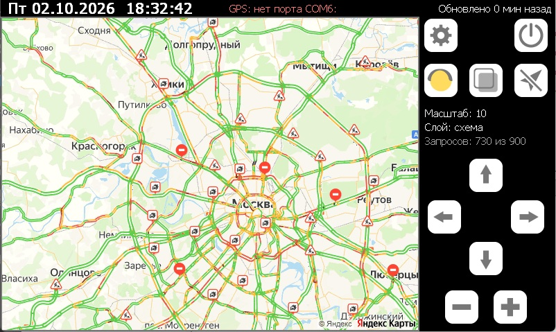

# YaMapsCE

Пробки Яндекс Карт на штатной ММС Lada Vesta (Windows CE 6.0, экран 800×480).
Одна программа без Python, MortScript и альтернативных оболочек. Картинки карты берутся
из [Static API](https://yandex.ru/maps-api/products/static-api) Яндекса и кэшируются на SD-карте.

## Возможности
- Схема, спутник, гибрид; пробки вкл/выкл.
- Карту можно перетаскивать пальцем, тап по карте — обновить (не чаще раза в минуту).
- Три режима GPS (кнопка со стрелкой, по кругу):
  - **выкл** (перечёркнутая стрелка) — карта стоит, по ней едет значок машины;
  - **север вверх** — центр карты на машине;
  - **по курсу** — карта повёрнута по направлению движения, машина у нижнего края.
- Кэш карт на SD: просмотренные места открываются без интернета и без запросов.
  Схема и спутник без пробок не устаревают, пробки обновляются раз в 10 минут.
- Если карты для масштаба нет, а скачать нельзя (нет сети, исчерпан лимит), показывается
  карта из кэша соседних масштабов.
- Суточный лимит запросов, чтобы не превысить ограничения Яндекса.
- Ночная карта (кнопка с месяцем): светлый фон становится тёмным, подписи светлыми, цвета пробок сохраняются; запоминается (`night` в ini).
- Экран настроек (шестерёнка): порт и скорость GPS, поиск порта, размер кэша, живой статус NMEA.

## Установка
1. Скачать архив из [Releases](../../releases) и распаковать в корень SD-карты: должна получиться папка `\SDMMC\YaMapsCE`.
2. Запустить `YaMapsCE.exe` (вручную или через AppLauncher).

При первом запуске рядом создаются `YaMapsCE.ini` (настройки), `YaMapsCE.log` (лог) и папка `Cache`.
ГУ при каждой загрузке сбрасывает реестр, но программе ничего устанавливать не нужно.

## GPS
На Весте координаты приходят от блока ЭРА-ГЛОНАСС по CAN, оболочка ГУ выдаёт их в COM-порт
(по умолчанию `COM6:`, 115200), где вместе с NMEA идут и другие данные. YaMapsCE читает этот порт
только на чтение, не меняя его настроек (кроме скорости, если она отличается), и выбирает из потока
строки NMEA. Если порт занят Навигатором СитиГИД, программа закрывает его (`kill=` в ini).

Проверить можно в настройках: счётчик «NMEA: N строк» должен расти.
- Строк нет — не тот порт: выберите другой или нажмите «Поиск GPS».
- Много строк с ошибкой — не та скорость.

**Если прямое чтение не работает** или мешает оболочке (например, пропала динамическая разметка
парковки), есть запасной вариант через GpsGate, который копирует NMEA на виртуальный `COM7:`:
1. Положить папку `GpsGate 2.0` в корень SD (в комплект не входит, версия для WinCE больше
   не распространяется — [4PDA](https://4pda.to/forum/index.php?showtopic=820802&st=2760#entry107172707)).
2. Запускать `YaMapsCE\GpsGate\Start.exe` вместо `YaMapsCE.exe`.
3. В настройках YaMapsCE выбрать порт `COM7:`.

## Настройки (`YaMapsCE.ini`)
Большинство меняется кнопками, остальное — в файле (при закрытой программе).

| Ключ | По умолчанию | Описание |
|---|---|---|
| `zoom`, `layer`, `traffic`, `follow` | 13, map, 1, 1 | масштаб, слой (map / sat / hybrid), пробки, режим GPS (0 выкл, 1 север, 2 курс) |
| `traffic_ttl` | 10 | через сколько минут обновлять пробки |
| `daily_limit` | 900 | максимум запросов к Яндексу в сутки |
| `auto_reserve` | 100 | автоматические обновления останавливаются на `daily_limit − auto_reserve`, остаток — для ручных действий |
| `cache_mb` | 500 | размер кэша на SD, МБ (в настройках: 250 / 500 / 1000 / 2000) |
| `cache_days` | 7 | карты без пробок старше стольких дней сверяются с сервером (0 — никогда): если карта не изменилась, Яндекс отвечает «304» без картинки и она не скачивается заново; дата берётся из GPS |
| `gps`, `gps_port`, `gps_baud` | 1, COM6:, 115200 | GPS вкл/выкл, порт, скорость (0 — не менять) |
| `kill` | CityGuideCE.exe | программа, которую закрыть, если она держит порт GPS (пусто — никогда) |
| `hide_taskbar` | 1 | скрывать панель задач |

`req_day`, `req_count`, `cache_kb` — служебные счётчики, менять не нужно.

## Лимиты и условия Яндекса
- Static API бесплатно: 10 000 запросов в сутки ([тарифы](https://yandex.ru/maps-api/tariffs)).
  Программа обращается к старому адресу без ключа, для которого исторически было около 1000 запросов
  в сутки с одного адреса, поэтому по умолчанию лимит 900.
- При регулярном превышении лимита Яндекс блокирует доступ без восстановления.
- Счётчик запросов виден на экране, сутки считаются по дате из GPS.
- Режимы «север вверх» и «по курсу» расходуют больше запросов: экран собирается из нескольких
  картинок (примерно 3 запроса на километр на масштабе 15 с пробками).
- Ознакомьтесь с [условиями бесплатного использования](https://yandex.ru/dev/commercial/doc/ru/) API Яндекс Карт.

## Если что-то не так
- Смотрите `YaMapsCE.log`: запросы, ошибки сети, состояние GPS и кэша. Лог ограничен 256 КБ,
  предыдущая часть сохраняется в `YaMapsCE.old.log`.
- Удалите `YaMapsCE.ini`, чтобы вернуть настройки по умолчанию.
- Папку `Cache` можно удалить целиком, если нужно освободить место.

## Сборка из исходников
Исходники в [native](native) (C++, Win32 API, PNG/JPEG через [stb_image](https://github.com/nothings/stb)).
Нужна Visual Studio 2005 Professional с поддержкой Smart Device и SDK Pocket PC 2003.

- `native\build.bat` — собирает `YaMapsCE\YaMapsCE.exe` (ARMv4, Windows CE) и `YaMapsCE\YaMapsPC.exe`
  (версия для Windows, чтобы проверять на компьютере; стрелки, `+`/`-`, `T` пробки, `L` слой, `G` GPS, `S` настройки).
- `native\test.bat` — тест разбора NMEA.
